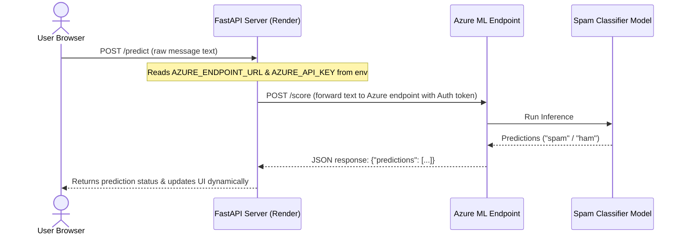

# 6. Web App Deployment on Render

Now that your model is hosted as an **Azure ML Online Endpoint**, we will build a FastAPI web application to serve as a production middleware API and frontend interface. 

Rather than hardcoding credentials, our FastAPI app will load the Azure ML Online Endpoint URL and authorization key from environment variables. Finally, we will containerize this application and deploy it to **Render** directly from **GitHub**.

---

## 🌐 Architecture Overview

The request flow path from a client web browser to our machine learning model on Azure is as follows:



---

## 🛠️ Step 1: Project Directory Structure

First, create the project directory and file structure on your local machine using your operating system's terminal:

### On macOS / Linux:
```bash
mkdir -p spam-app/templates
touch spam-app/main.py spam-app/requirements.txt spam-app/Dockerfile spam-app/templates/index.html spam-app/.env spam-app/.gitignore
```

### On Windows (Command Prompt):
```cmd
mkdir spam-app
mkdir spam-app\templates
type nul > spam-app\main.py
type nul > spam-app\requirements.txt
type nul > spam-app\Dockerfile
type nul > spam-app\templates\index.html
type nul > spam-app\.env
type nul > spam-app\.gitignore
```

### On Windows (PowerShell):
```powershell
New-Item -ItemType Directory -Path "spam-app/templates" -Force
New-Item -ItemType File -Path "spam-app/main.py", "spam-app/requirements.txt", "spam-app/Dockerfile", "spam-app/templates/index.html", "spam-app/.env", "spam-app/.gitignore" -Force
```

This creates the following file hierarchy:
```text
spam-app/
├── main.py
├── requirements.txt
├── Dockerfile
├── .env
├── .gitignore
└── templates/
    └── index.html
```

---

## 💻 Step 1b: Local Virtual Environment Setup

To test the application locally before deploying, configure a Python virtual environment, install the required libraries, and set up your local environment variables in a `.env` file.

### 1. Create and Activate Virtual Environment

Run the following commands inside the root directory (containing the `spam-app` folder):

#### On macOS / Linux:
```bash
cd spam-app
python3 -m venv venv
source venv/bin/activate
```

#### On Windows (Command Prompt):
```cmd
cd spam-app
python -m venv venv
call venv\Scripts\activate.bat
```

#### On Windows (PowerShell):
```powershell
cd spam-app
python -m venv venv
.\venv\Scripts\Activate.ps1
```

### 2. Configure Local Environment Variables (`.env` and `.gitignore`)

Rather than typing shell commands to export variables on every terminal session, we use a `.env` file to load settings automatically during local development.

#### How to Retrieve your Azure ML Credentials:
1. Open the **[Azure ML Studio](https://ml.azure.com/)**.
2. Select **Endpoints** from the left-hand navigation menu.
3. Click on your endpoint name (e.g., `spam-detector-endpoint-2026`).
4. Click on the **Consume** tab at the top of the endpoint page.
5. Under the **Basic consumption info** block, copy the following values:
   - **REST endpoint** &rarr; This is your `AZURE_ENDPOINT_URL`.
   - **Primary key** &rarr; This is your `AZURE_API_KEY`.

Once retrieved:

1. Open `.env` and add your Azure ML online endpoint REST URL and Primary Key:
   ```env
   AZURE_ENDPOINT_URL="YOUR_REST_ENDPOINT_URL_HERE"
   AZURE_API_KEY="YOUR_PRIMARY_KEY_HERE"
   ```
2. Open `.gitignore` and add the following lines to make sure your credentials and virtual environment directories are never checked into git or pushed to GitHub:
   ```text
   venv/
   .env
   __pycache__/
   .pytest_cache/
   ```

### 3. Install Dependencies
Make sure to populate your `main.py`, `templates/index.html`, and `requirements.txt` (shown in the steps below) first. Once the files are written, install the dependencies in your active virtual environment:
```bash
pip install -r requirements.txt
```

### 4. Run and Verify Locally
Start the local FastAPI development server:
```bash
python -m uvicorn main:app --reload
```
Because we call `load_dotenv()` in our code, FastAPI will automatically load variables from `.env` and connect to the Azure ML Endpoint. 

Open `http://127.0.0.1:8000` in your web browser to load the spam detection dashboard, enter text samples, and verify it successfully retrieves predictions from your online Azure ML Endpoint.

---

## 🐍 Step 2: Create the FastAPI Backend (`main.py`)

Write the FastAPI code to serve the frontend, ingest incoming requests from users, and proxy them to the Azure ML online endpoint securely.

```python
import os
import httpx
from fastapi import FastAPI, HTTPException
from fastapi.middleware.cors import CORSMiddleware
from pydantic import BaseModel
from fastapi.responses import HTMLResponse
from dotenv import load_dotenv

# Load environment variables from .env file (for local development)
load_dotenv()

app = FastAPI(
    title="Spam Detector Proxy API",
    description="Secures and routes frontend client requests to Azure ML Online Endpoints"
)

# Enable CORS (Cross-Origin Resource Sharing)
app.add_middleware(
    CORSMiddleware,
    allow_origins=["*"],
    allow_credentials=True,
    allow_methods=["*"],
    allow_headers=["*"],
)

# Load Azure ML Online Endpoint credentials from environment variables
AZURE_ENDPOINT_URL = os.getenv("AZURE_ENDPOINT_URL")
AZURE_API_KEY = os.getenv("AZURE_API_KEY")

class TextPayload(BaseModel):
    message: str

@app.get("/", response_class=HTMLResponse)
async def read_root():
    """Serves the main frontend page."""
    try:
        with open("templates/index.html", "r", encoding="utf-8") as f:
            return HTMLResponse(content=f.read(), status_code=200)
    except FileNotFoundError:
        raise HTTPException(status_code=404, detail="Frontend HTML file templates/index.html not found.")

@app.post("/predict")
async def predict_spam(payload: TextPayload):
    """Proxies user prediction request to the underlying Azure ML Endpoint."""
    if not AZURE_ENDPOINT_URL or not AZURE_API_KEY:
        raise HTTPException(
            status_code=500,
            detail="Azure ML credentials are not configured on the host server. Set AZURE_ENDPOINT_URL and AZURE_API_KEY."
        )

    headers = {
        "Content-Type": "application/json",
        "Authorization": f"Bearer {AZURE_API_KEY}"
    }
    
    # Azure ML online endpoint expects format: {"data": ["message_text"]}
    azure_payload = {"data": [payload.message]}

    async with httpx.AsyncClient() as client:
        try:
            response = await client.post(
                AZURE_ENDPOINT_URL,
                json=azure_payload,
                headers=headers,
                timeout=30.0
            )
            
            if response.status_code != 200:
                raise HTTPException(
                    status_code=response.status_code, 
                    detail=f"Azure ML endpoint returned error: {response.text}"
                )
            
            result = response.json()
            predictions = result.get("predictions", [])
            if not predictions:
                raise HTTPException(status_code=502, detail="Invalid response structure returned by Azure ML endpoint.")
            
            return {"message": payload.message, "prediction": predictions[0]}

        except httpx.RequestError as e:
            raise HTTPException(
                status_code=503, 
                detail=f"Failed to communicate with Azure ML inference server: {str(e)}"
            )
```

---

## 🎨 Step 3: Create the UI Frontend (`templates/index.html`)

Create a gorgeous, glassmorphic dark-theme frontend using Vanilla CSS and HTML. It features dynamic state transitions, loading indicators, and glowing color badges based on prediction output.

```html
<!DOCTYPE html>
<html lang="en">
<head>
    <meta charset="UTF-8">
    <meta name="viewport" content="width=device-width, initial-scale=1.0">
    <title>AI Spam Detector</title>
    <!-- Modern typography -->
    <link rel="preconnect" href="https://fonts.googleapis.com">
    <link rel="preconnect" href="https://fonts.gstatic.com" crossorigin>
    <link href="https://fonts.googleapis.com/css2?family=Inter:wght@400;500&family=Outfit:wght@600;700&display=swap" rel="stylesheet">
    
    <style>
        :root {
            --bg-primary: #030712;
            --accent-violet: #a78bfa;
            --accent-pink: #f472b6;
            --text-primary: #f9fafb;
            --text-secondary: #9ca3af;
            --glass-bg: rgba(255, 255, 255, 0.03);
            --glass-border: rgba(255, 255, 255, 0.08);
        }

        * {
            box-sizing: border-box;
            margin: 0;
            padding: 0;
        }

        body {
            background: radial-gradient(circle at center, #1e1b4b 0%, var(--bg-primary) 100%);
            font-family: 'Inter', sans-serif;
            color: var(--text-primary);
            min-height: 100vh;
            display: flex;
            justify-content: center;
            align-items: center;
            padding: 20px;
        }

        .app-container {
            background: var(--glass-bg);
            backdrop-filter: blur(16px);
            -webkit-backdrop-filter: blur(16px);
            border: 1px solid var(--glass-border);
            border-radius: 24px;
            padding: 40px 30px;
            width: 100%;
            max-width: 500px;
            box-shadow: 0 20px 50px rgba(0, 0, 0, 0.4);
            text-align: center;
            transition: all 0.3s cubic-bezier(0.4, 0, 0.2, 1);
        }

        h1 {
            font-family: 'Outfit', sans-serif;
            font-size: 2.2rem;
            font-weight: 700;
            margin-bottom: 8px;
            background: linear-gradient(135deg, var(--accent-violet) 0%, var(--accent-pink) 100%);
            -webkit-background-clip: text;
            -webkit-text-fill-color: transparent;
        }

        .subtitle {
            color: var(--text-secondary);
            font-size: 0.95rem;
            margin-bottom: 30px;
        }

        .form-group {
            margin-bottom: 20px;
            text-align: left;
        }

        label {
            display: block;
            font-size: 0.85rem;
            font-weight: 500;
            color: var(--text-secondary);
            margin-bottom: 8px;
            text-transform: uppercase;
            letter-spacing: 0.5px;
        }

        textarea {
            width: 100%;
            height: 120px;
            background: rgba(255, 255, 255, 0.01);
            border: 1px solid var(--glass-border);
            border-radius: 14px;
            color: var(--text-primary);
            padding: 16px;
            font-family: 'Inter', sans-serif;
            font-size: 0.95rem;
            resize: none;
            outline: none;
            transition: all 0.2s ease-in-out;
        }

        textarea:focus {
            border-color: var(--accent-violet);
            box-shadow: 0 0 15px rgba(167, 139, 250, 0.25);
            background: rgba(255, 255, 255, 0.03);
        }

        button {
            width: 100%;
            padding: 14px;
            background: linear-gradient(135deg, #7c3aed 0%, #db2777 100%);
            border: none;
            border-radius: 12px;
            color: white;
            font-family: 'Outfit', sans-serif;
            font-size: 1rem;
            font-weight: 600;
            cursor: pointer;
            transition: all 0.2s ease;
            display: flex;
            justify-content: center;
            align-items: center;
            gap: 10px;
        }

        button:hover:not(:disabled) {
            transform: translateY(-2px);
            box-shadow: 0 10px 20px rgba(124, 58, 237, 0.35);
            filter: brightness(1.05);
        }

        button:active:not(:disabled) {
            transform: translateY(0);
        }

        button:disabled {
            opacity: 0.6;
            cursor: not-allowed;
        }

        .loader {
            width: 18px;
            height: 18px;
            border: 2px solid rgba(255, 255, 255, 0.3);
            border-top: 2px solid white;
            border-radius: 50%;
            animation: spin 0.8s linear infinite;
            display: none;
        }

        @keyframes spin {
            0% { transform: rotate(0deg); }
            100% { transform: rotate(360deg); }
        }

        .result-card {
            margin-top: 28px;
            padding: 20px;
            border-radius: 16px;
            background: rgba(255, 255, 255, 0.01);
            border: 1px solid var(--glass-border);
            display: none;
            animation: fadeIn 0.4s cubic-bezier(0.4, 0, 0.2, 1) forwards;
        }

        @keyframes fadeIn {
            from { opacity: 0; transform: translateY(10px); }
            to { opacity: 1; transform: translateY(0); }
        }

        .badge {
            display: inline-block;
            padding: 6px 14px;
            font-weight: 700;
            text-transform: uppercase;
            font-size: 0.8rem;
            border-radius: 20px;
            letter-spacing: 1px;
            margin-bottom: 12px;
        }

        .badge.spam {
            background: rgba(239, 68, 68, 0.12);
            border: 1px solid rgba(239, 68, 68, 0.4);
            color: #f87171;
            box-shadow: 0 0 15px rgba(239, 68, 68, 0.2);
        }

        .badge.ham {
            background: rgba(16, 185, 129, 0.12);
            border: 1px solid rgba(16, 185, 129, 0.4);
            color: #34d399;
            box-shadow: 0 0 15px rgba(16, 185, 129, 0.2);
        }

        .badge.error {
            background: rgba(245, 158, 11, 0.12);
            border: 1px solid rgba(245, 158, 11, 0.4);
            color: #fbbf24;
            box-shadow: 0 0 15px rgba(245, 158, 11, 0.2);
        }

        .result-text {
            font-size: 0.95rem;
            line-height: 1.5;
            color: var(--text-primary);
        }
    </style>
</head>
<body>

    <div class="app-container">
        <h1>AI Spam Detector</h1>
        <p class="subtitle">Enter a message below to classify it in real-time</p>
        
        <div class="form-group">
            <label for="message">Message Text</label>
            <textarea id="message" placeholder="Type or paste your message details here..."></textarea>
        </div>
        
        <button id="submitBtn" onclick="analyzeText()">
            <span class="loader" id="btnLoader"></span>
            <span id="btnText">Analyze Message</span>
        </button>
        
        <div class="result-card" id="resultCard">
            <div id="resultBadge" class="badge">Spam</div>
            <p class="result-text" id="resultText"></p>
        </div>
    </div>

    <script>
        async function analyzeText() {
            const messageInput = document.getElementById('message');
            const submitBtn = document.getElementById('submitBtn');
            const btnLoader = document.getElementById('btnLoader');
            const btnText = document.getElementById('btnText');
            const resultCard = document.getElementById('resultCard');
            const resultBadge = document.getElementById('resultBadge');
            const resultText = document.getElementById('resultText');

            const text = messageInput.value.trim();
            if (!text) {
                alert('Please enter some text before analyzing!');
                return;
            }

            // Enter loading state
            submitBtn.disabled = true;
            btnLoader.style.display = 'inline-block';
            btnText.textContent = 'Processing...';
            resultCard.style.display = 'none';

            try {
                const response = await fetch('/predict', {
                    method: 'POST',
                    headers: {
                        'Content-Type': 'application/json'
                    },
                    body: JSON.stringify({ message: text })
                });

                const data = await response.json();
                
                if (!response.ok) {
                    throw new Error(data.detail || 'An error occurred during prediction.');
                }

                // Show prediction results
                resultCard.style.display = 'block';
                const prediction = data.prediction.toLowerCase();
                
                if (prediction === 'spam') {
                    resultBadge.className = 'badge spam';
                    resultBadge.textContent = 'Spam Detected';
                    resultText.textContent = 'Warning: This message matches profiles of fraudulent, marketing, or malicious communications.';
                } else {
                    resultBadge.className = 'badge ham';
                    resultBadge.textContent = 'Ham (Safe)';
                    resultText.textContent = 'This message appears safe. No indicators of spam or phishing detected.';
                }

            } catch (err) {
                // Show error state
                resultCard.style.display = 'block';
                resultBadge.className = 'badge error';
                resultBadge.textContent = 'Error';
                resultText.textContent = err.message;
            } finally {
                // Reset button state
                submitBtn.disabled = false;
                btnLoader.style.display = 'none';
                btnText.textContent = 'Analyze Message';
            }
        }
    </script>
</body>
</html>
```

---

## 📦 Step 4: Configure Dependencies (`requirements.txt`)

Define the package version references to install.

```text
fastapi==0.111.0
uvicorn==0.30.1
httpx==0.27.0
pydantic==2.7.4
python-dotenv==1.0.1
```

---

## 🐳 Step 5: Containerize the App (`Dockerfile`)

Create a `Dockerfile` in the root of your application folder to guarantee Render runs the app on a consistent runtime.

```dockerfile
FROM python:3.10-slim

WORKDIR /app

# Copy dependency configs and install
COPY requirements.txt .
RUN pip install --no-cache-dir -r requirements.txt

# Copy all source files
COPY . .

# Expose web port
EXPOSE 8000

# Start server
CMD ["uvicorn", "main:app", "--host", "0.0.0.0", "--port", "8000"]
```

---

## 🚀 Step 6: Initialize Git & Push to GitHub

Push your project directory to GitHub:

1. Initialize a new local git repository:
   ```bash
   git init
   git add .
   git commit -m "Initialize Spam Detector UI & API Server"
   ```
2. Create a new repository on **[GitHub](https://github.com/)** (keep it public or private).
3. Associate your local directory and push:
   ```bash
   git remote add origin https://github.com/YOUR_USERNAME/YOUR_REPOSITORY.git
   git branch -M main
   git push -u origin main
   ```

---

## ☁️ Step 7: Deploy Web Service to Render

1. Open the **[Render Dashboard](https://dashboard.render.com/)**.
2. Click the **New +** button in the top right, and select **Web Service**.
3. Link your GitHub account and select your repository (`YOUR_REPOSITORY`).
4. Set the following fields:
   - **Name:** `spam-detector-web-app`
   - **Region:** Select the closest region (e.g., `Oregon (US West)`)
   - **Branch:** `main`
   - **Runtime:** **Docker** (Render will automatically detect your `Dockerfile` and build it)
   - **Instance Type:** **Free** (select the free starter VM)
5. Scroll down to **Environment Variables** and click **Add Environment Variable**.
6. Set the credentials you retrieved from the **Consume** tab of your Azure ML Endpoint:
   - Key: `AZURE_ENDPOINT_URL` &rarr; Value: `(Your REST endpoint URL)`
   - Key: `AZURE_API_KEY` &rarr; Value: `(Your Primary Key)`
7. Click **Deploy Web Service** at the bottom of the page.
8. Wait for Render to build the image (takes 2–3 minutes) and start the container.
9. Once live, click the public `.onrender.com` link provided at the top left of your service dashboard, enter some text, and test your deployed AI Spam Detector!
