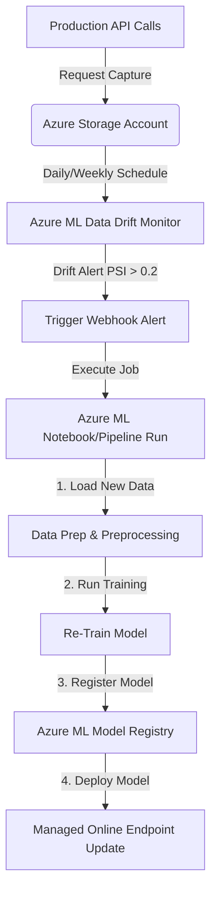

# 6. Monitoring & Retraining

Once your online model endpoint is deployed and serving traffic to your local FastAPI backend, the final MLOps stage is **Monitoring & Retraining**. This ensures that the model is healthy and does not degrade in quality due to concept drift or changes in spam content behavior.

We monitor model deployment health in Azure using **Application Insights** and track dataset changes using **Azure ML Model Monitoring**.

---

## Part A — Application Insights (System Health & Logs)

Application Insights tracks container execution, endpoint errors, latency, and request metrics.

### How to View Endpoint Logs
1. Go to your **Endpoint page** in [Azure ML Studio](https://ml.azure.com/).
2. Select your endpoint name (`spam-detector-endpoint-2026`).
3. Click the **Logs** tab at the top. Here, you will see real-time prints, stdout outputs, and errors from your container's `score.py` execution.
4. Go to the **Details** tab and click on the **Application Insights** resource link to view request/response failure rates, server latency graphs, and load metrics.

---

## Part B — Data Drift Monitoring

Data drift occurs when the input data sent to your live model starts to look significantly different from your baseline training data.

### Step 1: Capture Production Inputs
To monitor data drift, we must tell Azure to log all incoming API request payloads into a storage container. Modify your notebook deployment configuration to enable data collection:

```python
from azure.ai.ml.entities import DataCollector, DeploymentDataCollectionSettings

# Configure data collector to log 100% of inputs
data_collection_settings = DeploymentDataCollectionSettings(
    data_collector=DataCollector(
        enabled=True,
        sampling_rate=1.0,
        collections={"inputs": {"enabled": True}}
    )
)

# Apply settings to deployment object and update
deployment.data_collector = data_collection_settings
ml_client.begin_create_or_update(deployment).result()
```

### Step 2: Configure a Drift Monitor in Studio
1. In Azure ML Studio, click **Monitoring** on the left menu.
2. Click **+ Create** to setup a monitor.
3. Configure the monitor details:
   - **Baseline Dataset:** Select your baseline training data asset (`spam_raw_data`).
   - **Target Dataset:** Select the production data collection folder in storage.
   - **Metrics:** Select **Data Drift** (calculates Population Stability Index - PSI).
   - **Alerts:** Add your email to receive an alert if the drift metric PSI exceeds `0.2`.

---

## Part C — Automated Retraining Architecture

When a data drift alert is triggered, it signals that the model is losing accuracy. In an enterprise setting, this triggers an automated retraining pipeline:



To update the endpoint with a new model version programmatically:
```python
# Reference the newly registered model version
new_model = ml_client.models.get(name="spam_naive_bayes_model", version="2")

# Update deployment to load the new model
deployment.model = new_model
ml_client.begin_create_or_update(deployment).result()
```

---

## 📦 Required Packages

These are preinstalled in your Compute Instance environment:
```bash
pip install azure-ai-ml azure-identity
```
