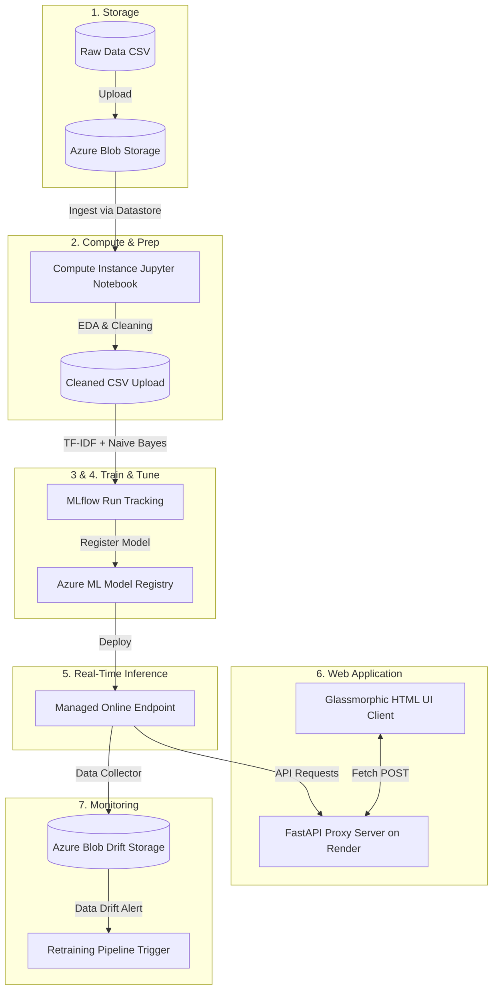
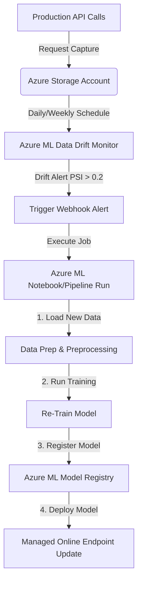

# Azure Cloud MLOps: End-to-End Spam Detection Pipeline

---

## Overview

This document is a comprehensive hands-on guide covering the end-to-end Machine Learning Operations (MLOps) lifecycle on Microsoft Azure and Render. 

We will build a production-ready **AI Spam Detector** from scratch, progressing through seven distinct phases:

1. **Data Collection & Storage**: Provisioning Azure Blob Storage and uploading datasets.
2. **Data Preparation & EDA**: Setting up an Azure ML Workspace, creating compute resources, registering datasets, and performing cleaning.
3. **Model Training & MLflow Tracking**: Training a Multinomial Naive Bayes model and tracking metrics dynamically in Azure using MLflow.
4. **Evaluation & Tuning**: Reviewing the workspace dashboard, running hyperparameter sweeps, and running AutoML.
5. **Model Deployment**: Deploying the registered model to a Managed Online Endpoint.
6. **Web App Deployment**: Wrapping the model into a FastAPI app with a glassmorphic HTML UI, and deploying it on Render via GitHub.
7. **Monitoring & Retraining**: Tracking drift alerts, production logs, and designing auto-retraining architectures.



---

## Module 1 — Data Collection & Storage

In our cloud-native machine learning lifecycle, all files, models, and run outputs are managed on Azure. The first stage is **Data Collection & Storage**. We use **Azure Blob Storage** (similar to AWS S3) as our secure data repository.

We will set up the storage account, create containers for our datasets, and upload our raw spam detection dataset (`spam.csv`).

### Step 1: Create a Storage Account (Azure Portal)
1. Open the [Azure Portal](https://portal.azure.com/).
2. In the top search bar, type **Storage accounts** and select it.
3. Click the **+ Create** button in the top left.
4. Fill in the basics tab:
   - **Subscription:** Select your subscription.
   - **Resource Group:** Click **Create new** and name it `spam-detection-rg`.
   - **Storage account name:** Enter a unique lowercase name (e.g., `spamdetectionsa2026`).
   - **Region:** Select a region (e.g., `East US`).
   - **Performance:** **Standard**.
   - **Preferred storage type:** Select **Azure Blob Storage or Azure Data Lake Storage** (the recommended choice for machine learning datasets and models).
   - **Redundancy:** Select **Locally-redundant storage (LRS)** (recommended for lab, learning, and dev/test environments as it is the lowest-cost option).
   - **All Other Settings (Advanced, Networking, Data protection, Encryption, Tags):** You can safely **leave these at their default settings**!
5. Click **Review + create** at the bottom, then click **Create**.
6. Wait for deployment, and click **Go to resource**.

### Step 2: Create Containers for Raw & Processed Data
1. Inside your Storage Account page, scroll down the left menu to **Data storage** and click **Containers**.
2. Click **+ Container** at the top.
   - **Name:** `raw-data`
   - **Public access level:** **Private**
   - Click **Create**.
3. Click **+ Container** again.
   - **Name:** `processed-data`
   - **Public access level:** **Private**
   - Click **Create**.

### Step 3: Upload the Raw Dataset
1. Click on the `raw-data` container in the list.
2. Click **Upload** at the top.
3. Browse and select your local dataset file: `spam.csv`.
4. Click **Upload**.

### Optional: Programmatic Ingestion (Python Upload)
If you want to upload the file programmatically from a script, run this Python script:

```python
import os
from azure.storage.blob import BlobServiceClient

# Configure connection details (Get Connection String from Storage Account -> Access keys)
CONNECTION_STRING = "YOUR_STORAGE_CONNECTION_STRING"
CONTAINER_NAME = "raw-data"
LOCAL_FILE = "spam.csv"

def upload_to_azure():
    if not os.path.exists(LOCAL_FILE):
        print(f"Error: Local file '{LOCAL_FILE}' not found.")
        return

    # Connect and upload
    blob_service_client = BlobServiceClient.from_connection_string(CONNECTION_STRING)
    blob_client = blob_service_client.get_blob_client(container=CONTAINER_NAME, blob="spam.csv")
    
    print(f"Uploading {LOCAL_FILE} to Azure Blob Storage...")
    with open(LOCAL_FILE, "rb") as data:
        blob_client.upload_blob(data, overwrite=True)
    print(f"Upload successful! Blob URL: {blob_client.url}")

if __name__ == "__main__":
    upload_to_azure()
```

---

## Module 2 — Data Preparation & EDA

Before training a model, we must explore and clean the dataset. In Azure, you can manage and track datasets securely using **Datastores** (connections to storage services) and **Data Assets** (versioned data references) inside **Azure Machine Learning Studio**.

### Step 1: Create an Azure Machine Learning Workspace
If you don't have an Azure ML Workspace yet:
1. Search for **Azure Machine Learning** in the Azure Portal.
2. Click **+ Create** ➔ **New workspace**.
3. In the **Basics** tab, configure the following:
   - **Subscription:** Select your subscription.
   - **Resource Group:** Choose the one you created in Step 1 (e.g., `spam-detection-rg`).
   - **Name:** Enter `spam-detection-mlw`.
   - **Region:** Choose the same region as your storage account (e.g., `East US`).
   - **Storage account, Key vault, Application insights:** Leave these at their default **Create new** settings. Azure will automatically generate its own default storage account to save workspace system logs and internal run artifacts. *(Note: Keep the "Create new" default here; do not select the storage account you created in Module 1. We will link your Module 1 storage account as a Datastore in Step 2 below).*
   - **Container registry:** Keep it at **None** (Azure will automatically create one later when we build custom environments/containers).
4. Click **Review + create** at the bottom, then click **Create**.
5. Once deployed, click **Go to resource**, then click **Launch studio** (which takes you to `ml.azure.com`).

### Step 2: Register a Datastore
A Datastore securely saves connection details to your Azure Blob Storage so you don't have to hardcode connection strings in your scripts.
1. In Azure ML Studio, click **Data** in the left menu.
2. Select the **Datastores** tab at the top, then click **+ Create**.
3. Configure the Datastore:
   - **Datastore name:** `spam_storage_ds`
   - **Datastore type:** **Azure Blob Storage**
   - **Account selection method:** From Azure subscription.
   - **Storage account:** Choose the storage account you created in Step 1 (e.g., `spamdetectionsa2026`).
   - **Blob container:** Select `raw-data` (which has your `spam.csv`).
   - **Authentication type:** Select **Account key**.
   - **Account key:** Paste the access key of your Storage Account (copy this from your Storage Account page ➔ **Access keys** ➔ **key1 Key** in the Azure Portal).
4. Click **Create**.

### Step 3: Register a Data Asset
1. In Azure ML Studio, go to **Data** on the left menu, select the **Data assets** tab, and click **+ Create**.
2. Set Name: `spam_raw_data`, Type: **File (uri_file)**. Click **Next**.
3. Choose **From Azure storage** ➔ Select the Datastore `spam_storage_ds` ➔ Browse to `spam.csv`. Click **Next**.
4. Review the schema details and click **Create**.

### Step 4: Create a Compute Instance to Run Notebooks
We will create a single Compute Instance that serves as our development environment for the entire MLOps workflow.
1. Go to **Compute** in the left menu of Azure ML Studio.
2. Under the **Compute instances** tab, click **+ New**.
3. Configure the following settings:
   - **Compute name:** Enter a unique name (e.g., `spam-detection-instance`).
   - **Virtual machine type:** Select **CPU**.
   - **Virtual machine size:** Select **Standard_DS11_v2** (2 cores, 14GB RAM, 28GB storage).
4. Click **Review + create** to review your settings. Verify they match these recommended defaults:
   - **Scheduling:** Auto shutdown should be **Enabled** (set to shut down after 60 minutes of inactivity to prevent extra charges).
5. Click **Create** (takes ~3 minutes).
6. Once running, go to **Notebooks** in the left menu, click **+** ➔ **Create new file**, select **Notebook (.ipynb)**, and attach it to your running compute instance. Choose the preinstalled kernel: **Python 3.10 - SDK v2**.

### Step 5: Data Preparation Notebook Cells
Write this Python code in the cells of your Jupyter Notebook to clean the dataset:

```python
import os
import pandas as pd
from azure.ai.ml import MLClient
from azure.identity import DefaultAzureCredential
from azure.storage.blob import BlobServiceClient

# 1. Connect to the Azure ML Workspace
# DefaultAzureCredential will automatically authenticate you inside the Compute Instance!
credential = DefaultAzureCredential()
ml_client = MLClient.from_config(credential=credential)

# 2. Retrieve the registered Data Asset
data_asset = ml_client.data.get(name="spam_raw_data", version="1")
print(f"Loading data from: {data_asset.path}")

# 3. Read dataset into Pandas
df = pd.read_csv(data_asset.path)

# 4. Exploratory Data Analysis (EDA)
print(f"Total records: {len(df)}")
print(df['label'].value_counts())  # Class balance

# 5. Clean Dataset
# Select only relevant columns, drop duplicates, and clean text explicitly
df = df[['label', 'message']]
df = df.dropna()
df = df.drop_duplicates()

import re
def clean_text(text):
    text = str(text).lower()                      # Convert to lowercase
    text = re.sub(r'[^a-zA-Z0-9\s]', '', text)    # Keep only letters, numbers, and spaces
    text = re.sub(r'\s+', ' ', text).strip()      # Normalize whitespace
    return text

df["message"] = df["message"].apply(clean_text)

# 6. Save the cleaned CSV file locally on the Compute Instance storage
cleaned_file = "spam_clean.csv"
df.to_csv(cleaned_file, index=False)
print("Data cleaned successfully!")

# 7. Upload cleaned dataset back to the 'processed-data' Blob container
CONNECTION_STRING = "YOUR_STORAGE_CONNECTION_STRING"
blob_service_client = BlobServiceClient.from_connection_string(CONNECTION_STRING)
blob_client = blob_service_client.get_blob_client(container="processed-data", blob="spam_clean.csv")

print("Uploading cleaned dataset to 'processed-data' container...")
with open(cleaned_file, "rb") as file_data:
    blob_client.upload_blob(file_data, overwrite=True)
print("Data Preparation complete!")
```

---

## Module 3 — Model Training & MLflow Tracking

We will train our Multinomial Naive Bayes model directly in our **Jupyter Notebook** running on our compute instance. All training execution, tracking, and model registering will happen inside the notebook cells using **MLflow** integrated into Azure ML.

### Cell 1: Load Clean Dataset & Split Data
```python
import pandas as pd
from sklearn.model_selection import train_test_split

# 1. Load the cleaned dataset saved in Module 2
clean_data_path = "spam_clean.csv"
df = pd.read_csv(clean_data_path)

# 2. Split features and labels
X = df['message'].values.astype('U')  # Message text
y = df['label'].values                # 'ham' or 'spam' label

X_train, X_test, y_train, y_test = train_test_split(
    X, y, test_size=0.2, random_state=42
)
print(f"Train size: {len(X_train)} | Test size: {len(X_test)}")
```

### Cell 2: Train & Evaluate the Model (Tracked via MLflow)
We Vectorize the text using TF-IDF and train a Naive Bayes classifier. We wrap the training loop with **MLflow** so that parameters and metrics are automatically tracked inside our Azure ML Workspace history!

```python
import os
import shutil
import mlflow
from sklearn.pipeline import Pipeline
from sklearn.feature_extraction.text import TfidfVectorizer
from sklearn.naive_bayes import MultinomialNB
from sklearn.metrics import precision_score, recall_score, f1_score

# 1. Start MLflow run to log performance metrics
mlflow.start_run()

print("Building and training Pipeline (TF-IDF Vectorizer + Multinomial NB)...")
pipeline = Pipeline([
    ('vectorizer', TfidfVectorizer()),
    ('classifier', MultinomialNB())
])

# Fit pipeline on raw text directly
pipeline.fit(X_train, y_train)

# 2. Evaluate model
predictions = pipeline.predict(X_test)
accuracy = (predictions == y_test).mean()
precision = precision_score(y_test, predictions, pos_label='spam')
recall = recall_score(y_test, predictions, pos_label='spam')
f1 = f1_score(y_test, predictions, pos_label='spam')

print(f"Model Accuracy:  {accuracy:.4f}")
print(f"Spam Precision:  {precision:.4f}")
print(f"Spam Recall:     {recall:.4f}")
print(f"Spam F1-Score:   {f1:.4f}")

# 3. Log metrics to Azure ML run history
mlflow.log_metric("Accuracy", accuracy)
mlflow.log_metric("Spam_Precision", precision)
mlflow.log_metric("Spam_Recall", recall)
mlflow.log_metric("Spam_F1_Score", f1)
mlflow.log_param("Model Type", "Multinomial Naive Bayes")
mlflow.log_param("Vectorizer Type", "TfidfVectorizer")

# 4. Save the model locally as an MLflow model (saves the entire pipeline!)
if os.path.exists("spam_nb_model"):
    shutil.rmtree("spam_nb_model")

mlflow.sklearn.save_model(
    sk_model=pipeline,
    path="spam_nb_model"
)

mlflow.end_run()
print("Model training run complete!")
```

### Cell 3: Register the Model in the Workspace Registry
Registering the model stores it in the central registry so it can be versioned and deployed as an endpoint.

```python
from azure.ai.ml import MLClient
from azure.identity import DefaultAzureCredential
from azure.ai.ml.entities import Model
from azure.ai.ml.constants import AssetTypes

# 1. Connect to Azure ML Workspace
credential = DefaultAzureCredential()
ml_client = MLClient.from_config(credential=credential)

# 2. Define the Model parameters (pointing to the local saved folder)
model_name = "spam_naive_bayes_model"
registered_model = Model(
    path="spam_nb_model",
    name=model_name,
    description="Multinomial Naive Bayes model for spam classification.",
    type=AssetTypes.MLFLOW_MODEL
)

# 3. Register model to workspace registry
print(f"Registering model '{model_name}' in the Azure ML registry...")
ml_client.models.create_or_update(registered_model)
print("Model registered successfully!")
```

---

## Module 4 — Evaluation & Tuning

Once your training cells have run, you can track and evaluate model performance metrics, compare runs, and optimize hyperparameters. 

### Part A — Metric Tracking & Evaluation (Azure ML Studio UI)
Any metrics logged in your training script via `mlflow.log_metric()` are saved automatically in your workspace history.
1. Open [Azure ML Studio](https://ml.azure.com/).
2. On the left sidebar, click **Jobs**.
3. Select your experiment name (e.g., `spam-detection-training`).
4. Click on your training run (named with a random adjective-noun string).
5. Click on the **Metrics** tab to view logged charts (accuracy, custom loss, F1-scores).
6. To compare multiple runs side-by-side: Go back to the experiment runs list, check the boxes next to different runs, and click **Compare** at the top.

### Part B — Hyperparameter Tuning (Simple Notebook Sweep)
We can perform a hyperparameter sweep directly inside our notebook using a Python loop and MLflow:

```python
import mlflow
from sklearn.pipeline import Pipeline
from sklearn.feature_extraction.text import TfidfVectorizer
from sklearn.naive_bayes import MultinomialNB
from sklearn.metrics import precision_score, recall_score, f1_score

# Define values to search over
alpha_values = [0.1, 0.5, 1.0, 2.0]

for alpha in alpha_values:
    # Start a nested child run for each parameter configuration
    with mlflow.start_run(run_name=f"NB_Alpha_{alpha}", nested=True):
        
        # Train model using Pipeline
        pipeline = Pipeline([
            ('vectorizer', TfidfVectorizer()),
            ('classifier', MultinomialNB(alpha=alpha))
        ])
        pipeline.fit(X_train, y_train)
        
        # Evaluate
        predictions = pipeline.predict(X_test)
        accuracy = (predictions == y_test).mean()
        precision = precision_score(y_test, predictions, pos_label='spam')
        recall = recall_score(y_test, predictions, pos_label='spam')
        f1 = f1_score(y_test, predictions, pos_label='spam')
        
        # Log to Azure ML run dashboard
        mlflow.log_param("alpha", alpha)
        mlflow.log_metric("Accuracy", accuracy)
        mlflow.log_metric("Spam_Precision", precision)
        mlflow.log_metric("Spam_Recall", recall)
        mlflow.log_metric("Spam_F1_Score", f1)
        
        print(f"Alpha: {alpha} | Accuracy: {accuracy:.4f} | F1-Score: {f1:.4f}")
```

### Part C — Automated ML (AutoML via UI)
You can run Automated ML (AutoML) directly from the UI without writing code:
1. In Azure ML Studio, click **Automated ML** on the left menu.
2. Click **+ New Automated ML job**.
3. Choose your dataset: Select `spam_raw_data`. Click **Next**.
4. Configure Job:
   - **Task type:** **Classification**.
   - **Target column:** Select `label`.
   - **Compute type:** Select **Serverless** (this runs on temporary serverless VMs managed by Azure).
5. Click **Submit** to run.

---

## Module 5 — Real-time Model Deployment

In this stage, we will deploy our registered model to an **Azure ML Managed Online Endpoint** (a hosted web service API) directly from our **Jupyter Notebook**.

### Cell 1: Write the Scoring Script (`score.py`)
We use the Jupyter `%%writefile` magic command to write our prediction scoring script (`score.py`) directly from the notebook onto the Compute Instance storage.

```python
# Create a folder for deployment configurations
import os
os.makedirs("deploy_src", exist_ok=True)
```

```python
%%writefile deploy_src/score.py
import os
import logging
import json
import mlflow
import re

def clean_text(text):
    text = str(text).lower()                      # Convert to lowercase
    text = re.sub(r'[^a-zA-Z0-9\s]', '', text)    # Keep only letters, numbers, and spaces
    text = re.sub(r'\s+', ' ', text).strip()      # Normalize whitespace
    return text

def init():
    """Runs once when the web service container starts. Loads the model."""
    global model
    
    # Get model folder path in container and load it
    model_path = os.getenv("AZUREML_MODEL_DIR")
    if not os.path.exists(os.path.join(model_path, "MLmodel")):
        model_path = os.path.join(model_path, "spam_nb_model")
        
    logging.info(f"Loading model from: {model_path}")
    model = mlflow.sklearn.load_model(model_path)

def run(raw_data):
    """Runs on every incoming API request. Expects JSON input."""
    logging.info("Prediction request received.")
    try:
        data = json.loads(raw_data)
        messages = data["data"]  # Expects list of strings: {"data": ["msg1", "msg2"]}
        
        # Apply the exact same text cleaning logic as training
        cleaned_messages = [clean_text(msg) for msg in messages]
        
        # Predict spam vs ham
        predictions = model.predict(cleaned_messages)
        
        return {"predictions": predictions.tolist()}
    except Exception as e:
        logging.error(f"Error: {str(e)}")
        return {"error": str(e)}
```

### Cell 2: Define and Create the Online Endpoint
```python
from azure.ai.ml import MLClient
from azure.identity import DefaultAzureCredential
from azure.ai.ml.entities import ManagedOnlineEndpoint

# Connect to workspace
ml_client = MLClient.from_config(credential=DefaultAzureCredential())

# Define endpoint configuration
endpoint_name = "spam-detector-endpoint-2026"
endpoint = ManagedOnlineEndpoint(
    name=endpoint_name,
    description="Online endpoint for spam detection",
    auth_mode="key"
)

# Submit creation
print(f"Creating endpoint '{endpoint_name}'...")
ml_client.begin_create_or_update(endpoint).result()
print("Endpoint created successfully!")
```

### Cell 3: Deploy the Model to the Endpoint
This provisions a virtual machine, packages our model and scoring script in a Docker container, and hosts it.

```python
from azure.ai.ml.entities import ManagedOnlineDeployment, CodeConfiguration, Environment

# 1. Retrieve the latest registered model version dynamically
latest_model = max(ml_client.models.list(name="spam_naive_bayes_model"), key=lambda x: int(x.version))
print(f"Deploying model '{latest_model.name}' version '{latest_model.version}'...")

# 2. Define a custom environment
custom_env = Environment(
    name="spam-detector-env",
    version="1",
    description="Custom environment for spam detector",
    image="mcr.microsoft.com/azureml/openmpi4.1.0-ubuntu22.04:latest",  # Standard active base image
    conda_file={
        "channels": ["conda-forge", "default"],
        "dependencies": [
            "python=3.10",
            "numpy",
            "pandas",
            "scikit-learn",
            "mlflow",
            {
                "pip": [
                    "azureml-inference-server-http",
                    "azureml-defaults"
                ]
            }
        ]
    }
)

# 3. Define deployment configuration
deployment = ManagedOnlineDeployment(
    name="blue",
    endpoint_name=endpoint_name,
    model=latest_model,
    environment=custom_env,
    code_configuration=CodeConfiguration(
        code="./deploy_src",
        scoring_script="score.py"
    ),
    instance_type="Standard_DS1_v2",  # Hosting VM size (low-cost, fits trial quotas)
    instance_count=1                 # Scale to 1 instance
)

# 4. Deploy model
print("Deploying model (takes ~5-10 minutes)...")
ml_client.begin_create_or_update(deployment).result()

# 5. Route 100% of endpoint traffic to this new deployment
endpoint.traffic = {"blue": 100}
ml_client.begin_create_or_update(endpoint).result()
print("Deployment complete!")
```

### Troubleshooting Common Deployment Failures
* **SubscriptionNotRegistered Error:** If endpoint creation fails with this error, go to the Azure Portal, open your **Subscription**, click **Resource Providers** on the left menu, search for `Microsoft.Cdn` and `Microsoft.PolicyInsights`, and click **Register**.
* **Failed Deployment (blue) in Unrecoverable State:** If a previous deployment execution failed, that slot remains in an unrecoverable state. Modify `name="blue"` in the notebook to `name="green"` or `name="blue-v2"` and re-run.
* **OutOfQuota Error:** If you have VM quota limitations on standard clouds, deploy locally on Docker inside the compute instance:
  ```python
  ml_client.online_deployments.begin_create_or_update(deployment, local=True)
  ```

---

## Module 6 — Web App Deployment on Render

Now that your model is hosted as an **Azure ML Online Endpoint**, we will build a FastAPI web application to serve as a production middleware API and frontend interface. Finally, we will containerize this application and deploy it to **Render** directly from **GitHub**.

### Step 1: Project Directory Structure
First, create the project directory and file structure on your local machine using your operating system's terminal:

#### On macOS / Linux:
```bash
mkdir -p spam-app/templates
touch spam-app/main.py spam-app/requirements.txt spam-app/Dockerfile spam-app/templates/index.html spam-app/.env spam-app/.gitignore
```

#### On Windows (Command Prompt):
```cmd
mkdir spam-app
mkdir spam-app\templates
type nul > spam-app\main.py
type nul > spam-app\requirements.txt
type nul > spam-app\Dockerfile
type nul > spam-app\templates\index.html
type nul > spam-app\.env
type nul > spam-app\.gitignore
```

This creates the following file hierarchy:
```text
spam-app/
├── main.py
├── requirements.txt
├── Dockerfile
├── .env
├── .gitignore
└── templates/
    └── index.html
```

### Step 2: Configure Local Environment Variables
Rather than typing shell export commands, we use a `.env` file to load settings automatically during local development.

1. Open **[Azure ML Studio](https://ml.azure.com/)** ➔ **Endpoints** ➔ Select your endpoint ➔ Go to the **Consume** tab. Copy **REST endpoint** and **Primary key**.
2. Open `.env` and paste:
   ```env
   AZURE_ENDPOINT_URL="YOUR_REST_ENDPOINT_URL"
   AZURE_API_KEY="YOUR_PRIMARY_KEY"
   ```
3. Open `.gitignore` and add:
   ```text
   venv/
   .env
   __pycache__/
   .pytest_cache/
   ```

### Step 3: Create the FastAPI Backend (`main.py`)
Write the FastAPI code to serve the frontend, ingest incoming requests, and proxy them to the Azure ML online endpoint securely.

```python
import os
import httpx
from fastapi import FastAPI, HTTPException
from fastapi.middleware.cors import CORSMiddleware
from pydantic import BaseModel
from fastapi.responses import HTMLResponse
from dotenv import load_dotenv

# Load environment variables from .env file (for local development)
load_dotenv()

app = FastAPI(
    title="Spam Detector Proxy API",
    description="Secures and routes frontend client requests to Azure ML Online Endpoints"
)

# Enable CORS
app.add_middleware(
    CORSMiddleware,
    allow_origins=["*"],
    allow_credentials=True,
    allow_methods=["*"],
    allow_headers=["*"],
)

# Load Azure ML credentials from environment
AZURE_ENDPOINT_URL = os.getenv("AZURE_ENDPOINT_URL")
AZURE_API_KEY = os.getenv("AZURE_API_KEY")

class TextPayload(BaseModel):
    message: str

@app.get("/", response_class=HTMLResponse)
async def read_root():
    try:
        with open("templates/index.html", "r", encoding="utf-8") as f:
            return HTMLResponse(content=f.read(), status_code=200)
    except FileNotFoundError:
        raise HTTPException(status_code=404, detail="templates/index.html not found.")

@app.post("/predict")
async def predict_spam(payload: TextPayload):
    if not AZURE_ENDPOINT_URL or not AZURE_API_KEY:
        raise HTTPException(
            status_code=500,
            detail="Azure ML credentials are not configured. Set AZURE_ENDPOINT_URL and AZURE_API_KEY."
        )

    headers = {
        "Content-Type": "application/json",
        "Authorization": f"Bearer {AZURE_API_KEY}"
    }
    
    azure_payload = {"data": [payload.message]}

    async with httpx.AsyncClient() as client:
        try:
            response = await client.post(
                AZURE_ENDPOINT_URL,
                json=azure_payload,
                headers=headers,
                timeout=30.0
            )
            
            if response.status_code != 200:
                raise HTTPException(status_code=response.status_code, detail=response.text)
            
            result = response.json()
            predictions = result.get("predictions", [])
            if not predictions:
                raise HTTPException(status_code=502, detail="Invalid response structure from Azure.")
            
            return {"message": payload.message, "prediction": predictions[0]}

        except httpx.RequestError as e:
            raise HTTPException(status_code=503, detail=f"Failed to communicate with Azure ML: {str(e)}")
```

### Step 4: Create the UI Frontend (`templates/index.html`)
The frontend is a modern glassmorphic interface that communicates with our FastAPI proxy server. It uses CSS gradients, layout styling, dynamic alerts, and loading symbols.

```html
<!DOCTYPE html>
<html lang="en">
<head>
    <meta charset="UTF-8">
    <meta name="viewport" content="width=device-width, initial-scale=1.0">
    <title>AI Spam Detector — Powered by Azure ML</title>
    <link href="https://fonts.googleapis.com/css2?family=Inter:wght@400;500;600&family=Outfit:wght@600;700;800&display=swap" rel="stylesheet">
    
    <style>
        :root {
            --bg-deep: #06080f;
            --bg-surface: rgba(255, 255, 255, 0.025);
            --border-subtle: rgba(255, 255, 255, 0.06);
            --text-bright: #f1f5f9;
            --text-dim: #94a3b8;
            --accent-1: #818cf8;
            --radius: 20px;
        }

        body {
            font-family: 'Inter', sans-serif;
            background: var(--bg-deep);
            color: var(--text-bright);
            min-height: 100vh;
            display: flex;
            justify-content: center;
            align-items: center;
            padding: 24px;
        }

        .card {
            width: 100%;
            max-width: 520px;
            background: var(--bg-surface);
            backdrop-filter: blur(40px);
            border: 1px solid var(--border-subtle);
            border-radius: var(--radius);
            padding: 40px;
            box-shadow: 0 30px 80px rgba(0, 0, 0, 0.6);
        }

        textarea {
            width: 100%;
            height: 120px;
            background: rgba(255, 255, 255, 0.02);
            border: 1px solid var(--border-subtle);
            border-radius: 12px;
            color: var(--text-bright);
            padding: 16px;
            resize: none;
            outline: none;
        }

        button {
            width: 100%;
            padding: 15px;
            background: linear-gradient(135deg, #6366f1, #a855f7);
            border: none;
            border-radius: 12px;
            color: white;
            font-weight: 700;
            cursor: pointer;
            margin-top: 20px;
        }

        .result-card {
            margin-top: 20px;
            padding: 16px;
            border-radius: 12px;
            display: none;
        }
    </style>
</head>
<body>
    <div class="card">
        <h1>AI Spam Detector</h1>
        <textarea id="messageInput" placeholder="Enter message here..."></textarea>
        <button onclick="analyzeText()">Analyze Message</button>
        <div id="resultCard" class="result-card"></div>
    </div>

    <script>
        async function analyzeText() {
            const text = document.getElementById('messageInput').value.trim();
            const resultCard = document.getElementById('resultCard');
            if(!text) return;

            try {
                const response = await fetch('/predict', {
                    method: 'POST',
                    headers: { 'Content-Type': 'application/json' },
                    body: JSON.stringify({ message: text })
                });
                const data = await response.json();
                resultCard.style.display = 'block';
                resultCard.textContent = `Result: ${data.prediction}`;
            } catch (err) {
                resultCard.style.display = 'block';
                resultCard.textContent = "Error running analysis.";
            }
        }
    </script>
</body>
</html>
```

### Step 5: Configure Dependencies & Dockerfile

#### `requirements.txt`
```text
fastapi==0.111.0
uvicorn==0.30.1
httpx==0.27.0
pydantic==2.7.4
python-dotenv==1.0.1
```

#### `Dockerfile`
```dockerfile
FROM python:3.10-slim
WORKDIR /app
COPY requirements.txt .
RUN pip install --no-cache-dir -r requirements.txt
COPY . .
EXPOSE 8000
CMD ["uvicorn", "main:app", "--host", "0.0.0.0", "--port", "8000"]
```

### Step 6: Local Virtual Environment Setup
1. Create and activate a virtual environment:
   - **macOS/Linux**: `python3 -m venv venv && source venv/bin/activate`
   - **Windows**: `python -m venv venv && venv\Scripts\activate.bat`
2. Install dependencies:
   ```bash
   pip install -r requirements.txt
   ```
3. Run the server locally:
   ```bash
   python -m uvicorn main:app --reload
   ```

### Step 7: Push to GitHub & Deploy to Render
1. Push your code files to a GitHub repository.
2. Open the **[Render Dashboard](https://dashboard.render.com/)**, select **New +** ➔ **Web Service**, and link your repository.
3. Configure the settings:
   - **Runtime:** **Docker**
   - **Instance Type:** **Free**
4. Add the **Environment Variables**:
   - `AZURE_ENDPOINT_URL` &rarr; `(Your endpoint REST URL)`
   - `AZURE_API_KEY` &rarr; `(Your endpoint Primary Key)`
5. Click **Deploy**.

---

## Module 7 — Monitoring & Retraining

Once your online model endpoint is deployed and serving traffic, the final MLOps stage is **Monitoring & Retraining**.

### Part A — Application Insights (System Health & Logs)
Application Insights tracks container execution, endpoint errors, latency, and request metrics.
1. In Azure ML Studio, select your endpoint page, and click the **Logs** tab to view real-time prints, stdout outputs, and errors from your container's `score.py` execution.
2. Go to the **Details** tab and click on the **Application Insights** resource link to view server latency graphs and load metrics.

### Part B — Data Drift Monitoring
Data drift occurs when the input data sent to your live model starts to look significantly different from your baseline training data.
1. Capture inputs: Modify your notebook deployment configuration to enable data collection:
   ```python
   from azure.ai.ml.entities import DataCollector, DeploymentDataCollectionSettings

   data_collection_settings = DeploymentDataCollectionSettings(
       data_collector=DataCollector(
           enabled=True,
           sampling_rate=1.0,
           collections={"inputs": {"enabled": True}}
       )
   )

   deployment.data_collector = data_collection_settings
   ml_client.begin_create_or_update(deployment).result()
   ```
2. Configure a Drift Monitor in Studio: Go to **Monitoring** on the left menu, select **+ Create**, choose your baseline training dataset (`spam_raw_data`) and target production folder, set drift metrics, and add email alerts.

### Part C — Automated Retraining Architecture
When a drift alert is triggered (e.g., Population Stability Index PSI > 0.2), it runs an automated retraining pipeline:



To update the endpoint with a new model version programmatically:
```python
# Reference the newly registered model version
new_model = ml_client.models.get(name="spam_naive_bayes_model", version="2")

# Update deployment to load the new model
deployment.model = new_model
ml_client.begin_create_or_update(deployment).result()
```
